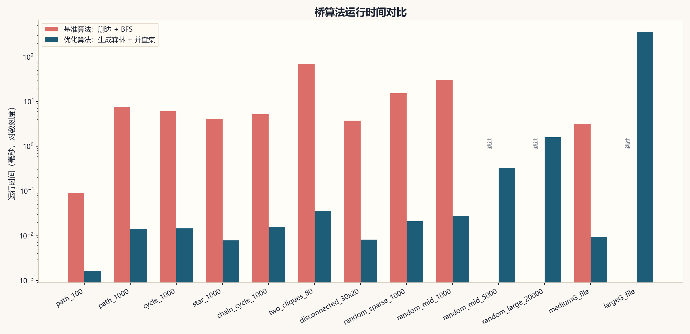
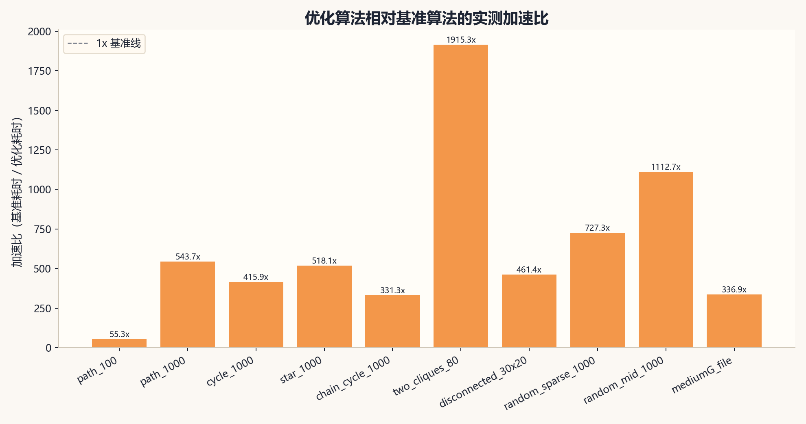
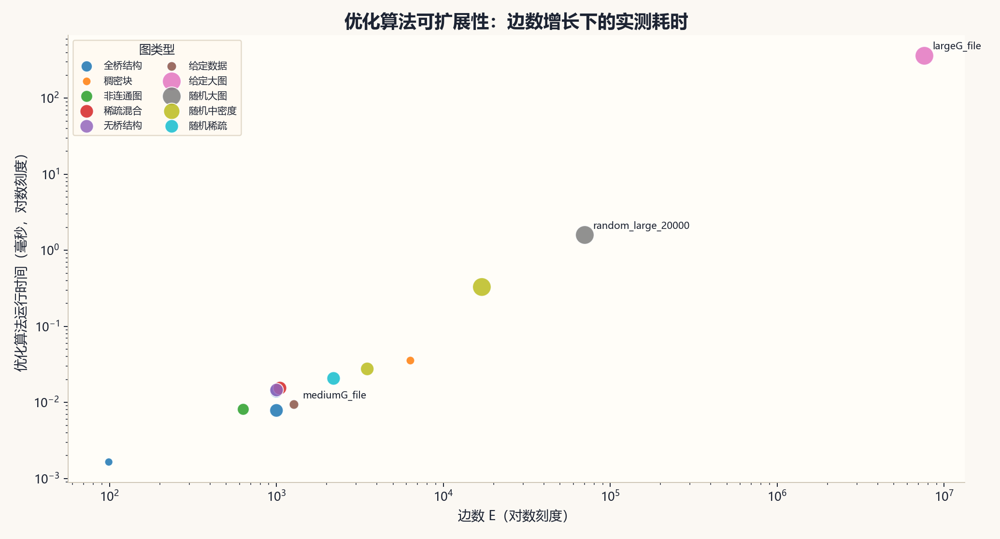
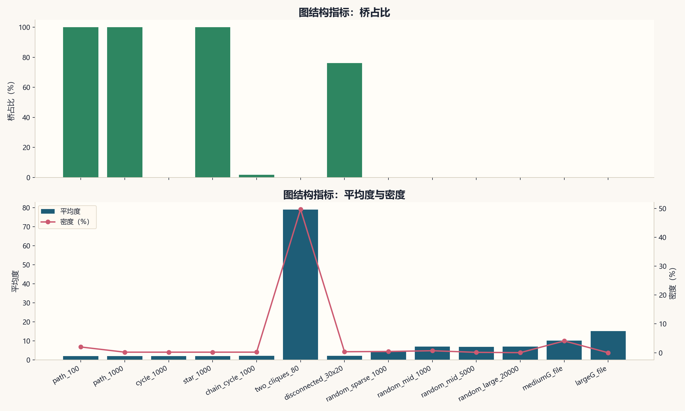
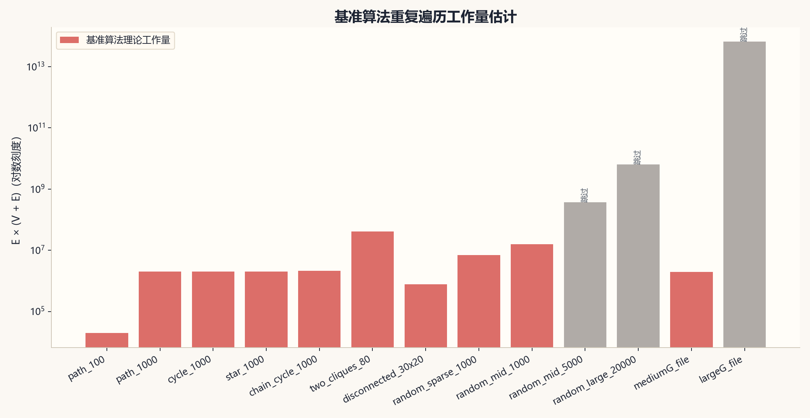
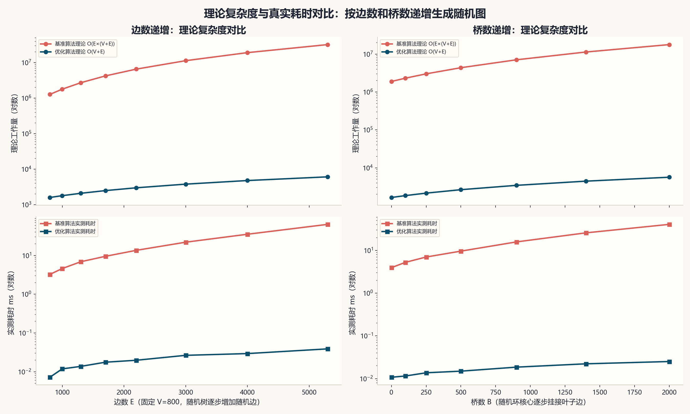

# 桥算法多角度性能实验分析

由 `benchmark_runner.cpp` 运行实验，并由 `analysis/plot_bridge_results.py` 生成图表。

## 图表

## 实验结果表

| 用例 | 类型 | V | E | 连通分量 | 平均度 | 密度 | 基准 ms | 优化 ms | 桥数 | 桥占比 | 加速比 | 优化吞吐 edges/ms | 状态 |
|---|---|---:|---:|---:|---:|---:|---:|---:|---:|---:|---:|---:|---|
| path_100 | 全桥结构 | 100 | 99 | 1 | 1.98 | 0.020000 | 0.091 | 0.002 | 99 | 100.00% | 55.26x | 60121.46 | ok |
| path_1000 | 全桥结构 | 1000 | 999 | 1 | 2.00 | 0.002000 | 7.664 | 0.014 | 999 | 100.00% | 543.67x | 70867.82 | ok |
| cycle_1000 | 无桥结构 | 1000 | 1000 | 1 | 2.00 | 0.002002 | 6.077 | 0.015 | 0 | 0.00% | 415.85x | 68430.66 | ok |
| star_1000 | 全桥结构 | 1001 | 1000 | 1 | 2.00 | 0.001998 | 4.069 | 0.008 | 1000 | 100.00% | 518.12x | 127334.47 | ok |
| chain_cycle_1000 | 稀疏混合 | 1000 | 1048 | 1 | 2.10 | 0.002098 | 5.170 | 0.016 | 19 | 1.81% | 331.34x | 67165.14 | ok |
| two_cliques_80 | 稠密块 | 160 | 6321 | 1 | 79.01 | 0.496934 | 68.913 | 0.036 | 1 | 0.02% | 1915.31x | 175680.93 | ok |
| disconnected_30x20 | 非连通图 | 600 | 630 | 30 | 2.10 | 0.003506 | 3.762 | 0.008 | 480 | 76.19% | 461.41x | 77269.01 | ok |
| random_sparse_1000 | 随机稀疏 | 1000 | 2199 | 1 | 4.40 | 0.004402 | 15.245 | 0.021 | 0 | 0.00% | 727.34x | 104914.12 | ok |
| random_mid_1000 | 随机中密度 | 1000 | 3499 | 1 | 7.00 | 0.007005 | 30.699 | 0.028 | 0 | 0.00% | 1112.69x | 126821.31 | ok |
| random_mid_5000 | 随机中密度 | 5000 | 16999 | 1 | 6.80 | 0.001360 | 跳过 | 0.329 | 0 | 0.00% | - | 51605.95 | baseline_skipped |
| random_large_20000 | 随机大图 | 20000 | 69999 | 1 | 7.00 | 0.000350 | 跳过 | 1.598 | 0 | 0.00% | - | 43791.34 | baseline_skipped |
| mediumG_file | 给定数据 | 250 | 1273 | 1 | 10.18 | 0.040900 | 3.181 | 0.009 | 0 | 0.00% | 336.85x | 134804.09 | ok |
| largeG_file | 给定大图 | 1000000 | 7586063 | 1 | 15.17 | 0.000015 | 跳过 | 365.451 | 8 | 0.00% | - | 20758.09 | baseline_skipped |

## 多角度结论

### 1. 理论复杂度与真实耗时角度

- 理论/实测对比图改为使用专门生成的随机图，不再混用不同类型样例编号作为横坐标。
- 第一组固定 `V=800`，逐步增加随机边数，横坐标为边数 `E`；第二组使用随机环核心挂接叶子边，横坐标为桥数 `B`。
- 基准算法理论曲线由 `E × (V + E)` 决定，随边数增长明显加速；优化算法理论曲线用 `V + E` 近似，增长更平缓。

### 2. 实测耗时角度

- 同时运行两种算法的样例中，最大加速比出现在 `two_cliques_80`，约 `1915.31x`。
- 最大图 `largeG_file`：`V=1000000`，`E=7586063`，优化算法耗时 `365.451 ms`，桥数 `8`。
- `two_cliques_80` 原先因为理论工作量 `40966401` 超过旧阈值被跳过；本次已实测基准算法，耗时 `68.913 ms`，优化算法耗时 `0.036 ms`。

### 2.1 随机复杂度递增实验

| 实验 | 横坐标 | V | E | 桥数 | 基准 ms | 优化 ms | 加速比 |
|---|---:|---:|---:|---:|---:|---:|---:|
| 边数递增 | 799 | 800 | 799 | 799 | 3.248 | 0.007223 | 449.65x |
| 边数递增 | 999 | 800 | 999 | 329 | 4.594 | 0.011873 | 386.95x |
| 边数递增 | 1299 | 800 | 1299 | 117 | 6.889 | 0.013773 | 500.15x |
| 边数递增 | 1699 | 800 | 1699 | 47 | 9.516 | 0.017657 | 538.97x |
| 边数递增 | 2199 | 800 | 2199 | 16 | 13.583 | 0.019820 | 685.30x |
| 边数递增 | 2999 | 800 | 2999 | 1 | 22.012 | 0.026560 | 828.75x |
| 边数递增 | 3999 | 800 | 3999 | 0 | 35.287 | 0.029470 | 1197.39x |
| 边数递增 | 5299 | 800 | 5299 | 0 | 63.478 | 0.038970 | 1628.89x |
| 桥数递增 | 0 | 500 | 1150 | 0 | 3.954 | 0.010790 | 366.47x |
| 桥数递增 | 100 | 600 | 1250 | 100 | 5.261 | 0.011533 | 456.17x |
| 桥数递增 | 250 | 750 | 1400 | 250 | 7.015 | 0.013727 | 511.02x |
| 桥数递增 | 500 | 1000 | 1650 | 500 | 9.637 | 0.014983 | 643.16x |
| 桥数递增 | 900 | 1400 | 2050 | 900 | 15.833 | 0.018600 | 851.23x |
| 桥数递增 | 1400 | 1900 | 2550 | 1400 | 25.785 | 0.022250 | 1158.86x |
| 桥数递增 | 2000 | 2500 | 3150 | 2000 | 40.759 | 0.025180 | 1618.71x |

### 3. 图结构角度

- 桥占比最高的是 `path_100`，桥占比约 `100.00%`。
- 路径图、星形图这类树结构几乎所有边都是桥；环图、随机较密图中桥占比明显下降。
- 密度和平均度越高，边更容易出现在环中，桥数量通常会减少。

### 4. 大图可行性角度

- `baseline_skipped` 并不是缺失结果，而是实验设计上的必要处理：基准算法需要对每条边重复做全图遍历，大图上等待成本没有意义。
- 对大图保留优化算法结果，并用理论工作量图解释基准算法为什么跳过，更适合实验报告。

### 5. 吞吐角度

- 优化算法最高吞吐出现在 `two_cliques_80`，约 `175680.93 edges/ms`。
- 小图耗时受计时粒度影响较大，所以吞吐指标更适合观察中大规模样例。

## 实验说明

- 本实验没有修改桥查找算法实现，只扩展了实验 runner 和绘图分析脚本。
- 优化算法耗时采用按规模自适应重复运行后的平均值；基准算法耗时为单次运行结果。
- 基准算法只在理论工作量可控的样例上运行；大图记录为 `baseline_skipped`。
- 在同时运行两种算法的样例中，若桥数量不一致，状态会标记为 `bridge_count_mismatch`。
